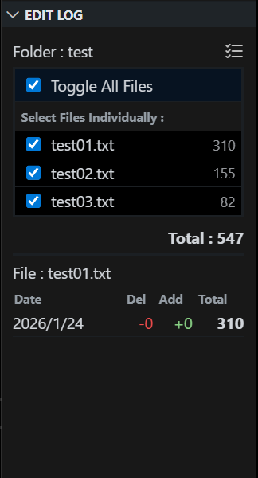
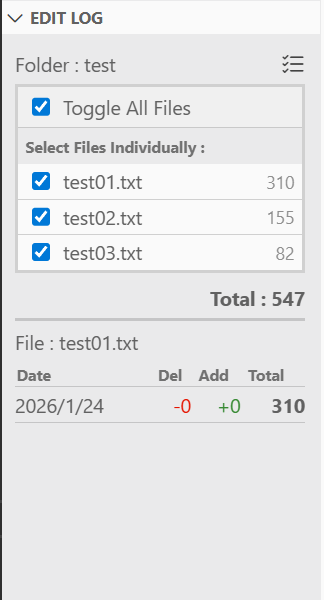
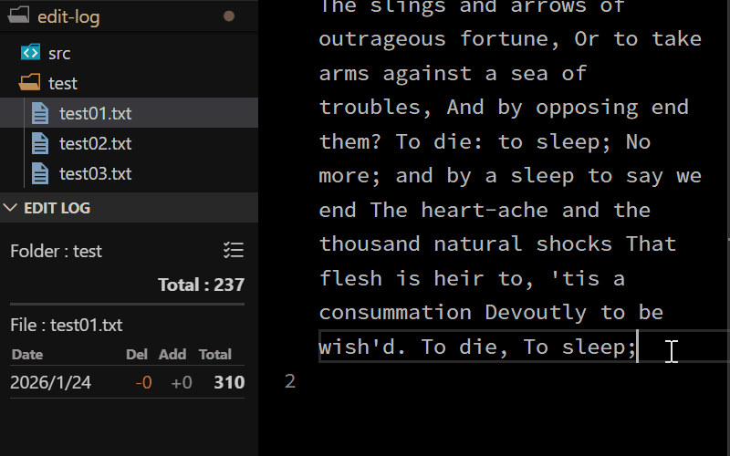
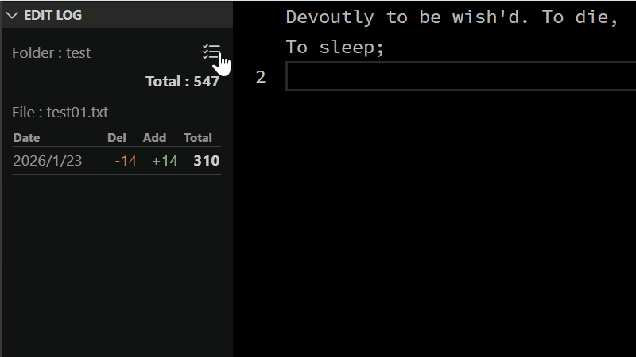

# Edit Log

When you activate a file in the Explorer, it displays the editing history for that file for the current day, including characters deleted, characters added, and the final character count. As long as the file name and its location remain unchanged, the editing history is recorded daily and displayed in a clear list. At the top of the view, you can see the name of the folder the file belongs to, along with the total character count of all files within that folder. The export and import features also ensure history is preserved even if files are renamed or moved.

## Key Features

- **Real-time Character Counting**: Accurately counts characters in the active document, excluding whitespace and newlines.
- **Multibyte Character Support**: Fully supports multibyte characters, such as Japanese (tested and verified), ensuring accurate tracking for global writers.
- **Folder Statistics**: View the combined character count for all files within the current folder.
- **Customizable Aggregation**: Toggle specific files on or off via a checklist to include or exclude them from the folder total. These settings are saved per workspace.
- **Daily Edit History**: A detailed table showing how much you've added or deleted each day, along with the total count.
- **Native VS Code Integration**: Built with official VS Code Codicons and theme-aware styling for a seamless look and feel.
- **History Backup & Migration**: Export and import your editing history as CSV files. This ensures your data is safe and can be migrated if you rename or move files.

## How to Use

1. The **EDIT LOG** view is integrated into the **Explorer** side bar (the folder icon). If you cannot find it, right-click anywhere in the Explorer side bar and ensure **EDIT LOG** is checked to make it visible.
1. Click the **EDIT LOG** title in the side bar to expand the view.
1. Open any text file to see its individual character count and the folder's total volume.
1. Click the **Checklist Icon** next to the folder name to select which files should be included in the total. This allows you to exclude specific files or logs from your project's aggregate count.
1. You can toggle all files on or off at once using the **"Toggle All Files"** checkbox.
1. Your writing progress is automatically recorded every time you save a file.
1. **Export/Import History**: Click the **ellipsis (...) icon** in the **EDIT LOG** view title bar to access the **"Export File History"** and **"Import File History"** commands.
1. **Data Recovery on File Renames**: Since history is tracked by the file's full path, moving or renaming a file will normally cause its history to disappear from the view. To fix this:
    - Export the history of the original file to a CSV.
    - Open the new/renamed file.
    - Import the CSV. A warning will appear stating the path mismatch—select **"Yes, Import Anyway"** to restore and link the history to the new file path.

### Record of text edits within files

&nbsp;

### File selection for total character count

&nbsp;

### Export and Import file edit history

## Counting Logic
To ensure accuracy for Japanese and global users, this extension uses `Intl.Segmenter` to correctly count surrogate pairs (such as emojis) as a single character. For a focused writing experience, the following are excluded from the count:
- Half-width and full-width spaces
- Tabs
- Newline characters
